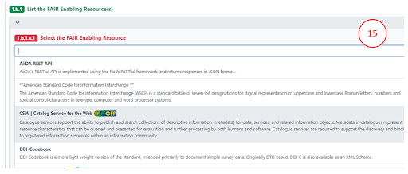

# Completing the FIP questionnaire

The FIP questionnaire has 26 questions (referred to in the FIP ontology as “declarations”), divided among 7 chapters.

&ensp;&ensp;&ensp; I. About

&ensp;&ensp;&ensp; II. Declare your FAIR Implementation Community

&ensp;&ensp;&ensp; III. Declarations for Findability

&ensp;&ensp;&ensp; IV. Declarations for Accessibility

&ensp;&ensp;&ensp; V. Declarations for Interoperability

&ensp;&ensp;&ensp; VI. Declarations for Reusability

&ensp;&ensp;&ensp; VII. Register a new resource as a nanopublication

On the left, the FIP Wizard displays a questionnaire navigation tool, indicating the chapters and the number of questions that still need to be answered for each chapter (10).

If you click on any chapter in the navigation tool all questions of that chapter will be displayed. Clicking on any question on the left will automatically lead you to that question in the central area of the Wizard.

In the questionnaire, questions that have been answered will be highlighted in green, and those that still need to be answered will be highlighted in red. All questions need to be answered except the last one of chapter VI which is a statement for R1.3. The FIP Wizard will use the resulting FIP as the definitive answer for  domain-relevant community standards (don’t mind that it remains red) (11).

&ensp;&ensp;&ensp; **Chapter I. About**, gives some background information but has no associated questions.

&ensp;&ensp;&ensp; **Chapter II. Declare your FAIR Implementation Community (FIC)** (12)

This chapter contains 4 questions:

&ensp;&ensp;&ensp; 1. Identify your FIC by using the drop-down / autocomplete functions in the text box. If you do not see your community, you’ll have to first mint a nanopublication representing your community (see below).

&ensp;&ensp;&ensp; 2. Identify the person who will be responsible for completing the FIP questionnaire (the community data steward) using ORCID.  

&ensp;&ensp;&ensp; 3. Start date of the validity of the FIP.

&ensp;&ensp;&ensp; 4. End date of the validity of the FIP. It may be the case that an explicit end date has yet to be specified by your community, in this case answer with "December 31 2050".

The F, A, I and R chapters have a series of questions that follow the same format. The explanatory help text throughout these chapters builds upon [Jacobsen et al (2020) “FAIR Principles: Interpretations and Implementation Considerations”](https://direct.mit.edu/dint/article/2/1-2/10/10017/FAIR-Principles-Interpretations-and-Implementation) and reflects also the GO FAIR Foundation’s interpretations which can be accessed at the GO FAIR Foundation’s website: https://www.gofair.foundation/interpretation. This link should help you to understand precisely what type of FAIR Enabling Resource (FER) is being asked for in each case, and for what purpose. Note, in most cases, identical questions are repeated specifically addressing that issue for both data and metadata. In total, there are 12 different FER types, but a FER might be of more than one type (a metadata scheme can also include provenance information and therefore be a FER for F2 and R1.2), see this list with FER examples.

There is a common pattern for each of the questions referring to each FAIR Principles. The questions begin by asking you to make an explicit declaration, about the usage of FAIR Enabling Resources regarding that Principle within your community. 

If your community uses a resource that is not FAIR, you have two options: 

&ensp;&ensp;&ensp; I. In case your community is not in control of the resource, choose option **a. No Implementations choice** and add the resource as free text in the **Considerations** box (13).

&ensp;&ensp;&ensp; II. In case your community is in control of the resource and plans to FAIRify it choose **Declaration: FAIR Enabling Resource(s)**, and define that you are going to use it in future (see below).

If your community uses a resource that has some level of FAIRness, then click option **b.** and add (declare) the FAIR Enabling Resource (or a list of resources) by clicking the **+Add** button (14). 

The questionnaire asks you to select (from the drop-down list) a FER for that particular FAIR Principle (15). 

Note: those items in the list that are marked with the GFF qualification logo are quality-checked by the GO FAIR team

Others without badges have not yet been quality-checked

Your selection has a follow-up question regarding the usage status of that FER in your community. Is the FER:

&ensp;&ensp;&ensp; **a. Currently in use by the community**

&ensp;&ensp;&ensp; **b. Currently in use, but is planned to be replaced in the future**

&ensp;&ensp;&ensp; **c. Is planned to be used in the future**

Answering **b** will open another text box, allowing you to select the replacement FER.

Lastly, there is a free-text box where you may record the  considerations behind your declared choices. These are typically the requirements and constraints your community has identified  that factor into the implementation.

Add additional FERs if necessary by clicking the **Add +** button and repeating the cycle. 

&ensp;&ensp;&ensp; **Chapter VII. Register a new resource as a nanopublication**

There are 3 cases where you will need to mint a new nanopublication before you can complete the FIP questionnaire:

&ensp;&ensp;&ensp; I. creating a new FAIR Implementation Community (FIC)

&ensp;&ensp;&ensp; II. creating a new FAIR Enabling Resource (FER): either taking preferably metadata from FAIRsharing or creating new metadata

&ensp;&ensp;&ensp; III. creating a Metadata Preservation Policy (MPP)

By clicking on the “template” link in each case, you will be taken to the dialog box for creating a new project - in this case, a new Wizard project template for authoring nanopublications (i.e., the nanoWizard). 

Once you have successfully created a new nanopublication, it will become immediately visible (and selectable) to you and others in the appropriate drop-down lists of the FIP Wizard 3.0. 

