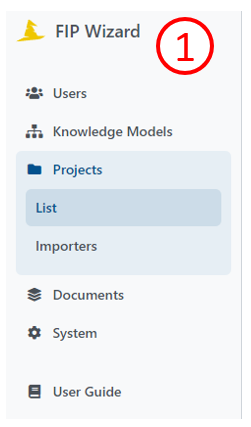
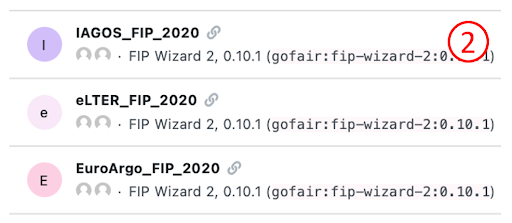
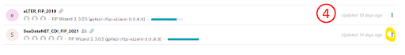
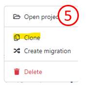
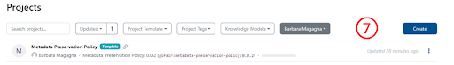

# Getting started with the FIP Wizard 3.0

1.	Go to https://fip-wizard.ds-wizard.org: log in or sign up. 
2.	Click **Projects** (a folder icon in the menu bar on the left) (1).

You will see a long list of projects on the right (2). FIPs are project’s and are named by the community that composed them 

You can create FIPs either from scratch or by cloning an existing FIP, and revising it.
- **Clone and adapt the FIP project**

By default, you can see only projects you created.

&ensp;&ensp;&ensp; a.    To see all projects click on the button where you can see your name and click **Clear selection** (3).

  

&ensp;&ensp;&ensp; b.    Locate your reference FIP in the list.

&ensp;&ensp;&ensp; c.    If your FIP has an orange annotation **update available** click on the three dots on the right (4).

  

&ensp;&ensp;&ensp; d.    Select **Create Migration**, click **Create** and **resolve all**. This will update your project with the newest Knowledge Model.

&ensp;&ensp;&ensp; e.    Then click again on the three dots and select **Clone** (5).

 

 

&ensp;&ensp;&ensp; f.    This will bring you to the FIP questionnaire. To change the name of the FIP you need to go to **Settings** (6). You can now start to work with the FIP Wizard questionnaire, and modify the previous FIP declarations (see below). 

 

- **Make a new FIP**

&ensp;&ensp;&ensp; a.    Click **Create** (blue button on the top menu bar) (7).

  

  

You’ll see **Create Project** - this dialog box will launch your new FIP (8).

 

  

&ensp;&ensp;&ensp; b.    Select the tab: **From Project Template**

&ensp;&ensp;&ensp; c.    Enter a name for your FIP: We recommend [Community acronym]_FIP

&ensp;&ensp;&ensp; d.    Select a template from the drop-down list
You’ll see here 5 templates

&ensp;&ensp;&ensp; e.    select **FAIR Implementation Profile**  
Later, when minting nanopublications, you’ll use the other templates:
   - A FAIR Implementation Community (FIC)
   - A FAIR Enabling Resource from FAIRsharing
   - A FAIR Enabling Resource (FER)
   - A Metadata Preservation Policy (MPP)
     
&ensp;&ensp;&ensp; f.    Click **Save**. This will bring you to the FIP questionnaire. You can now start to work with the FIP Wizard questionnaire, and make FIP declarations (see below).

Principally there should be one and only one person who acts as a data steward for the community and enters all answers. However, in most cases the answers will need to be agreed upon by an expert team of that community. By clicking on the **Share button** on the top right you can provide editing or viewing rights for your colleagues (9).
   

  

