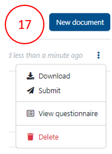
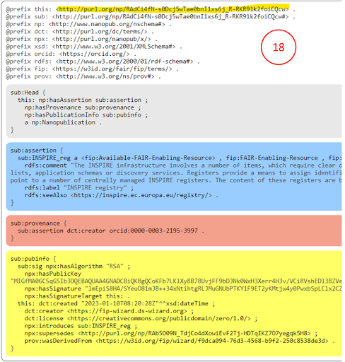

# Minting nanopublications
**What is a nanopublication?**

A nanopublication is a unitary assertion about the world with associated metadata, rendered in machine-readable form, and all of this having a globally unique, persistent and resolvable identifier (see [here](https://nanopub.net/) and [here](https://peerj.com/articles/cs-387/)).

Nanopublications are authored using cryptographic keys that make them hard to forge and corrupt. So once published, they are persistent and immutable.

Multiple nanopublications can be “contained” or bundled using a special kind of nanopublication called “index nanopublications”.

**Why nanopublication?**
  
-	These computational properties of nanopublications can be powerfully leveraged to make machine-readable FIPs.

-	This happens in two ways:

    - Individual components of the FIP (such as the FIC and FERs) are all represented as nanopublications.

    - The output of the FIP Wizard 3.0 (see *Publishing your FIP*) is an index nanopublication that provides a list of declared FERs for every FIC.

**How to mint FER nanopublications in the FIP Wizard**
  
1. Go to *VII. Register a new resource as a nanopublication*

2. Click on one of the four “template” links
 
   This takes you to a new project dialog box. 

3. Select the tab: **From Template**

4. Enter a name for your new nanopub. There is no specific format required here for the name.

5. Click **Save**. This will bring you to the questionnaire.

   There are only two chapters:

    - **Author** - provide your ORCID.
    - **Definition** - various details required to build your nanopublication. For Communities you may choose a “supercommunity” to which your community belongs which will help in the analysis of the results. For FERs you have to identify the appropriate FER type. More than one FER type can apply. A FER might be available or 'to be developed'.

    For the name of the resource you are creating you should avoid ‘,’ use a pipe (|) with a space before and after that symbol (for enabling a better findability) if you want to add both an acronym and a longer name like **Envthes | Environmental Thesaurus**

6. After completing the project, go to **Documents** (16) and make a **new document**.

7. For Template choose **Nanopublication Template** and for Format choose **RDF Trig**.

8. Push **Create**.

    If no error appears you can submit the nanopub clicking on the three dots (17):

9. Choose **Nanopub Server** (not the local one, which is only for testing) and **submit**.

10. Click on **view submission**.

You will see the submission as a FER nanopub (18), the persistent identifier (nanopub URI) is highlighted in yellow.

This FER will now appear, automatically, in the drop downs of the question where the FER type is expected (e.g. identifier for F1).

The newly created FER will not yet have a GFF qualification, as this review process will take a few days. If it is not accepted you will get a notification about the reason.

You can, however, already use the FER before it gets a qualification.

