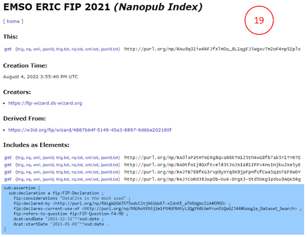
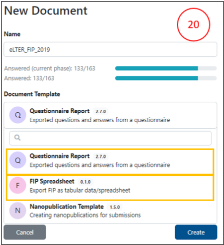
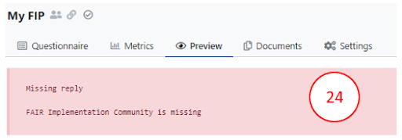
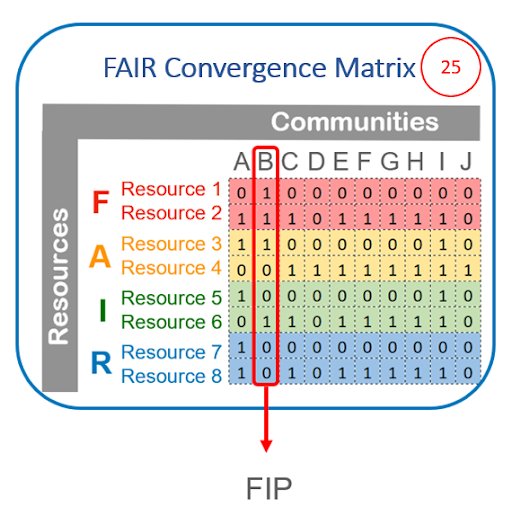

# Publishing your FIP

Your completed FIP questionnaire should include: 

- Your community nanopub,

- The ORCID for the community data steward,

- All questions completed.

To publish your FIP follow these steps:

1.    Click **Documents** (top menu bar).

2.    Click **New Document** (blue button, right side of upper menu bar).

3.    Be sure to set **Nanopublication Template** and **RDF TriG** to get a machine-readable output.

4.    Click **Create**.

5.    If no error appears you can submit the FIP by clicking on the **three dots**.

6.    Choose **Nanopub Server**.

7.    Click on **view submission**.

You will see the created FIP index nanopub (18)

If you want to get a human-readable output (19) you could choose as document template:

&ensp;&ensp;&ensp;&ensp; I.    **Questionnaire Report** which gives you the options to create PDFs or Word documents

&ensp;&ensp;&ensp;&ensp; II.    **FIP Spreadsheet** to get CSV or Excel files (20)

If an error appears (21), you should be aware that all questions must have explicit answers: Some questions may have **null** answers, i.e., declarations that no choice was made. 

By choosing **HTML Preview** of the **Nanopublication Template** (in **Settings** - 22) you can see in **Preview mode** the question that needs revision (23).

Error messages can flag possible issues such as:

- Missing FAIR Implementation Community

- Missing or wrong style of ORCID

- Missing answer

- Wrong answer (providing text instead of a nanopublication)

- For some question(s), you did not select a resource

- For some question(s), you did not select the replacement resource (when option b is selected)

- For some question(s), the considerations field was left empty

All the nanopublications representing your FIP -  i.e., the FIC, the many FERs, and the index nanopub (indeed, all the semantic triples) - will be stored in a dedicated triple store and are available via a [SPARQL endpoint](https://virtuoso.nps.petapico.org/sparql). 
To get a matrix of all created FIPs, called FIP Matrix (24) download the [new_matrix.csv](https://github.com/peta-pico/dsw-nanopub-api/blob/main/tables/new_matrix.csv).

