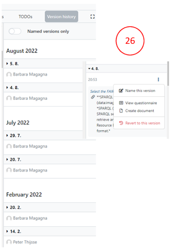

# Revising your FIP

Changes in the FIP are automatically saved.

There is no undo button for any action BUT you can use the version history button (26) which allows you to:

- see all changes done by any editors

- see details on each activity when clicking on it

- by clicking on the three dots you see a menu with an option to revert to this version

If you want to answer a specific question later, click on the **plus button** to get a **TODO reminder** (27).

Clicking the TODO button you will see all the TODOs as list.

For each question, you can add a comment and replies to that comment which should assist interactions within your team.
